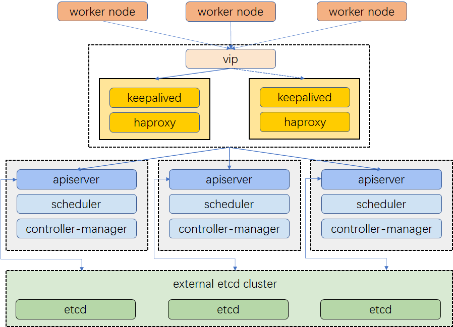

# **Kubernetes Cluster Automation and Provisioning**

This project automates the creation and provisioning of a Kubernetes cluster. The infrastructure is set up using Terraform to provision VMs on VMware vSphere, and Ansible is used to automate the installation of the Kubernetes cluster using `kubeadm`.

## **Architecture**

The architecture of the Kubernetes cluster is as follows:

- 3 Master Nodes
- 3 Worker Nodes
- 2 Load Balancers (using Keepalived and HAProxy)
- External etcd Cluster

